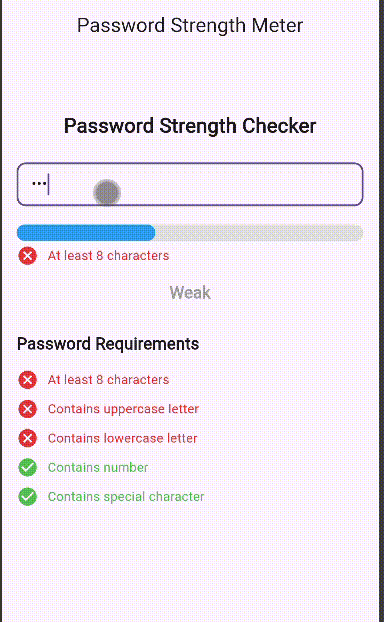

# library_flutter_password_strengthchecker

A lightweight and highly customizable Flutter package for real-time password strength calculation and validation. It provides interactive widgets to display strength levels and requirement checklists with custom icons and colors.

## When To Use

This package is perfect for implementing secure and user-friendly password validation in various scenarios:

* **Registration Forms**: Guide users to create strong passwords during account creation.
* **Sign Up Screens**: Provide instant feedback on password complexity.
* **Login Systems**: Use it for "Change Password" or "Reset Password" flows.
* **Banking Applications**: Enforce strict security standards for financial apps.
* **E-Commerce Applications**: Protect customer data with robust password requirements.
* **Admin Panels**: Ensure administrative accounts use complex credentials.
* **Enterprise Apps**: Maintain corporate security compliance.

## Perfect For

* **Developers** who need a quick and easy way to add password validation.
* **Apps** requiring real-time feedback for better user experience.
* **Projects** that need full control over the UI/UX of password meters.
* **Material 3** compatible applications.

## Features

| Feature | Description |
| :--- | :--- |
| **Password Strength Calculation** | Real-time calculation based on multiple security criteria. |
| **Weak / Medium / Strong Detection** | Categorizes password strength into three clear levels. |
| **Password Requirement Validation** | Checks for length, case, numbers, and special characters. |
| **Minimum Length Validation** | Ensures passwords meet the minimum length requirement (8+). |
| **Uppercase Validation** | Detects presence of uppercase letters. |
| **Lowercase Validation** | Detects presence of lowercase letters. |
| **Number Validation** | Detects presence of numeric characters. |
| **Special Character Validation** | Detects presence of special characters/symbols. |
| **Custom Requirement Icons** | Fully customizable icons for satisfied and empty states. |
| **Custom Colors** | Control colors for every state of the meter and requirements. |
| **Null Safe** | Built with modern Dart null-safety standards. |
| **Lightweight** | Minimal footprint and no external dependencies. |
| **Material 3 Compatible** | Designed to work seamlessly with modern Flutter themes. |

## Components

| Component | Description |
| :--- | :--- |
| **PasswordStrengthResult** | A model class that holds the calculated strength and validation results. |
| **calculatePasswordStrength()** | A function that evaluates a password string and returns a `PasswordStrengthResult`. |
| **Passwordmeter** | A progress indicator widget that visualizes the password strength. |
| **Requirements** | A widget that displays individual password requirements with status icons. |

## Parameters

### Passwordmeter

| Parameter | Type | Description |
| :--- | :--- | :--- |
| `strength` | `double` | The current strength value (0.0 to 1.0). |
| `strengthColor` | `Color` | The color of the progress indicator bar. |
| `backgroundColors` | `Color` | The background color of the progress indicator. |
| `minHight` | `double` | The height of the progress indicator (default: 18). |
| `borderRadius` | `BorderRadius?` | The border radius of the progress bar. |

### Requirements

| Parameter | Type | Description |
| :--- | :--- | :--- |
| `text` | `String` | The descriptive text for the requirement. |
| `isSatisfied` | `bool` | Whether the specific requirement is met. |
| `passwordCtrl` | `TextEditingController`| Controller to monitor the password field state. |
| `isSatisfiedtrueIcon` | `IconData` | Icon shown when the requirement is met. |
| `isSatisfiedtrueIconColor`| `Color` | Color of the icon when the requirement is met. |
| `isSatisfiedfasleIcon` | `IconData` | Icon shown when the requirement is not met. |
| `isSatisfiedfalseIconColor`| `Color` | Color of the icon when the requirement is not met. |
| `isEmplyIcon` | `IconData` | Icon shown when the password field is empty. |
| `isEmplyIconColor` | `Color` | Color of the icon when the password field is empty. |

## Installation

Add this to your `pubspec.yaml`:

```yaml
dependencies:
  library_flutter_password_strengthchecker: latest_version
```

### Git Installation

```yaml
dependencies:
  library_flutter_password_strengthchecker:
    git:
      url: https://github.com/Excelsior-Technologies/library_flutter_password_strengthchecker.git
```

### CLI Installation

```bash
flutter pub add library_flutter_password_strengthchecker
```

## Import

```dart
import 'package:library_flutter_password_strengthchecker/library_flutter_password_strengthchecker.dart';
```

## Usage Examples

### Calculate Password Strength

Evaluate any string to get detailed validation results and strength score.

```dart
final result = calculatePasswordStrength(password);

print(result.text);      // e.g., "Medium"
print(result.strength);  // e.g., 0.6
print(result.hasNumber); // true/false
```

### Password Meter

Use the `Passwordmeter` widget to visualize the strength.

```dart
Passwordmeter(
  strength: result.strength,
  strengthColor: result.strength <= 0.4 ? Colors.red : Colors.green,
  backgroundColors: Colors.grey[200]!,
)
```

### Requirements Widget

Display a single requirement with status feedback.

```dart
Requirements(
  text: "At least 8 characters",
  isSatisfied: result.hasMinLength,
  passwordCtrl: _passwordController,
)
```

### Full Example

A complete implementation showing real-time feedback.

```dart
import 'package:flutter/material.dart';
import 'package:library_flutter_password_strengthchecker/library_flutter_password_strengthchecker.dart';

void main() => runApp(const MaterialApp(home: PasswordExample()));

class PasswordExample extends StatefulWidget {
  const PasswordExample({super.key});

  @override
  State<PasswordExample> createState() => _PasswordExampleState();
}

class _PasswordExampleState extends State<PasswordExample> {
  final _controller = TextEditingController();
  PasswordStrengthResult? _result;

  @override
  Widget build(BuildContext context) {
    return Scaffold(
      appBar: AppBar(title: const Text('Password Strength Checker')),
      body: Padding(
        padding: const EdgeInsets.all(20.0),
        child: Column(
          children: [
            TextField(
              controller: _controller,
              onChanged: (value) {
                setState(() {
                  _result = calculatePasswordStrength(value);
                });
              },
              decoration: const InputDecoration(labelText: 'Password'),
            ),
            const SizedBox(height: 20),
            if (_result != null) ...[
              Passwordmeter(
                strength: _result!.strength,
                strengthColor: _result!.strength <= 0.4 
                    ? Colors.red : _result!.strength <= 0.8 
                    ? Colors.orange : Colors.green,
                backgroundColors: Colors.grey[200]!,
              ),
              const SizedBox(height: 10),
              Text('Strength: ${_result!.text}'),
              const SizedBox(height: 20),
              Requirements(
                text: "At least 8 characters",
                isSatisfied: _result!.hasMinLength,
                passwordCtrl: _controller,
              ),
              Requirements(
                text: "Contains Uppercase",
                isSatisfied: _result!.hasUpperCase,
                passwordCtrl: _controller,
              ),
              Requirements(
                text: "Contains Number",
                isSatisfied: _result!.hasNumber,
                passwordCtrl: _controller,
              ),
            ],
          ],
        ),
      ),
    );
  }
}
```

## Password Validation Rules

The strength is calculated based on the following 5 rules:

✓ **At least 8 characters**

✓ **Contains uppercase letter**

✓ **Contains lowercase letter**

✓ **Contains number**

✓ **Contains special character**

## Strength Levels

* **Weak**: Score of 0-2 requirements met.
* **Medium**: Score of 3-4 requirements met.
* **Strong**: All 5 requirements met.

## Demo Vedio

```html

``` 


## License

MIT License

Copyright (c) 2026 Excelsior Technologies

Permission is hereby granted, free of charge, to any person obtaining a copy
of this software and associated documentation files (the "Software"), to deal
in the Software without restriction, including without limitation the rights
to use, copy, modify, merge, publish, distribute, sublicense, and/or sell
copies of the Software, and to permit persons to whom the Software is
furnished to do so, subject to the following conditions:

The above copyright notice and this permission notice shall be included in all
copies or substantial portions of the Software.

THE SOFTWARE IS PROVIDED "AS IS", WITHOUT WARRANTY OF ANY KIND, EXPRESS OR
IMPLIED, INCLUDING BUT NOT LIMITED TO THE WARRANTIES OF MERCHANTABILITY,
FITNESS FOR A PARTICULAR PURPOSE AND NONINFRINGEMENT. IN NO EVENT SHALL THE
AUTHORS OR COPYRIGHT HOLDERS BE LIABLE FOR ANY CLAIM, DAMAGES OR OTHER
LIABILITY, WHETHER IN AN ACTION OF CONTRACT, TORT OR OTHERWISE, ARISING FROM,
OUT OF OR IN CONNECTION WITH THE SOFTWARE OR THE USE OR OTHER DEALINGS IN THE
SOFTWARE.
